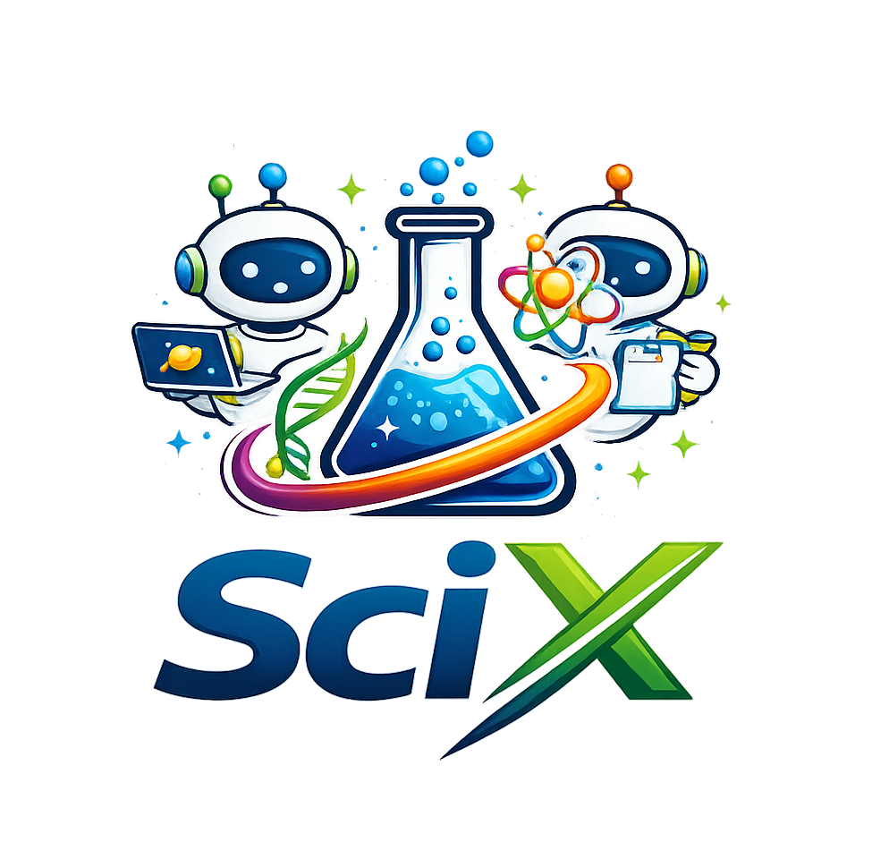

<h4 align="center">
  
</h4>

<p align="center">
  <i>Multi-repo workspaces, organized for reliable AI collaboration and reusable agent skills.</i>
</p>

<p align="center">
  <strong>scix-hub</strong> is a template for teams and individuals who want one repository to coordinate cloned repos, shared AI policy, generated agent files, and domain-specific lessons that can be carried across machines and collaborators.
</p>

<p align="center">
  <a href="#quick-start">Quick Start</a> &nbsp;&bull;&nbsp;
  <a href="#learning-skills">Learning Skills</a> &nbsp;&bull;&nbsp;
  <a href="#agent-cli-setup">Agent CLI Setup</a> &nbsp;&bull;&nbsp;
  <a href="#workflow">Workflow</a> &nbsp;&bull;&nbsp;
</p>

<br/>

## Introduction

`scix-hub` is a workspace template for projects that depend on one or more external repositories. Users fork or clone this repository, edit a small set of canonical files, and use `make` targets to bootstrap the workspace.

It is designed to give you:

- a `repos.yaml` file that declares which repos to clone and what they own
- a `requirements.txt` file for the shared local Python environment
- a `repos/` directory for cloned reference repositories
- a `workspace/` directory for your own scripts, simulation, drafts, and docs
- generated `AGENTS.md`, `CLAUDE.md`, skills, hooks, and tool config derived from a single editable AI canon under `ai/`
- a built-in `student` role that can turn lessons from conversation into reusable skills

Forking is recommended because it gives you a central GitHub repo for syncing learned skills and workflow updates across machines and collaborators. Users should expect to need GitHub account.

For a concrete example of this layout in planetary-science research, see [zoeyzyhu/scix](https://github.com/zoeyzyhu/scix).

## Quick Start

For a new `scix-hub` workspace:

```bash
git clone <your-forked-or-this-repo-url> scix-hub
cd scix-hub
python3 -m venv xenv
source xenv/bin/activate
python -m pip install --upgrade pip
python -m pip install -r requirements.txt
```

Edit these two files first:

- `repos.yaml`: which repositories should be cloned, where they live, and what they own
- `requirements.txt`: which Python dependencies you want in the shared local environment

Then bootstrap the repo:

```bash
make up
```

`make up` will:

1. regenerate root AI files from `repos.yaml` and `ai/`
2. clone any missing repositories declared in `repos.yaml`
3. write repo-local overlays into cloned repos when present
4. try to install missing `nvm`, Node.js/npm, Codex CLI, and Claude Code

The commands you will use most often are:

| Command | Use it when |
| --- | --- |
| `make up` | You want to bootstrap or refresh this checkout. |
| `make sync` | You changed `repos.yaml` or editable files under `ai/`. |
| `make sync-check` | You want CI-safe validation for generated files. |
| `make install-repos` | One or more configured repos are still missing. |
| `make doctor` | You want a quick health check for this checkout. |
| `make cheat` | You want a compact command reference. |
| `make ci` | You want the main maintenance checks before pushing changes. |

Whenever you return to the workspace, reactivate the local environment:

```bash
source xenv/bin/activate
```

### Learning Skills

This repo ships with a `student` role for capturing durable lessons. If you
start a message with `203 /learn`, the agent can turn the current conversation
into a reusable domain-specific skill.

Typical flow:

1. start a conversation with the agent and teach it something specific
2. if the lesson feels reusable and worth remembering for future work, send a
   sentence that starts with `203 /learn`
3. you can include the specific learning point yourself, or let the agent
   summarize the lesson for you
4. the agent proposes the lesson title, target skill folder, and summary
5. you confirm the proposal or provide feedback until it is right
6. the agent updates `ai/skills/*/SKILL.md` and refreshes generated files
7. commit the new skill and push it to GitHub if you want it available from
   other machines or for collaborators

## Agent CLI Setup

`make up` tries to install missing `nvm`, user-local Node.js/npm, Codex CLI,
and Claude Code automatically.

If that automatic step fails, run this fallback sequence exactly:

```bash
curl -o- https://raw.githubusercontent.com/nvm-sh/nvm/v0.40.4/install.sh | bash
export NVM_DIR="$HOME/.nvm"
[ -s "$NVM_DIR/nvm.sh" ] && . "$NVM_DIR/nvm.sh"
nvm install --lts
nvm use --lts
nvm alias default lts/*
npm install -g @openai/codex
npm install -g @anthropic-ai/claude-code
```

If `codex` or `claude` is still unavailable, start a new shell or load your
shell profile with:

```bash
source ~/.bashrc
# or if you use zsh:
source ~/.zshrc
```

Official references:

- [Codex CLI Setup](https://developers.openai.com/codex/cli/)
- [Claude Code Quickstart](https://code.claude.com/docs/en/quickstart)

### Authenticate Codex

```bash
codex login
```

Alternative auth flows:

```bash
codex login --device-auth
printenv OPENAI_API_KEY | codex login --with-api-key
```

If your installed Codex CLI uses different login syntax, check:

```bash
codex --help
```

### Authenticate Claude

```bash
claude auth login
```

If you use a token-based flow:

```bash
claude setup-token
```

## Workflow

### Terminal Workflow

From the workspace root:

```bash
source xenv/bin/activate
codex
```

or:

```bash
source xenv/bin/activate
claude
```

### Editable vs Generated

The main editable inputs are:

- `repos.yaml`
- `requirements.txt`
- `ai/agents/roles.yaml`
- `ai/policy/*.md`
- `ai/skills/*/SKILL.md`
- `ai/hooks/*.sh`

Generated outputs include:

- `ai/policy/repos.yaml`
- `AGENTS.md`
- `CLAUDE.md`
- `.codex/*`
- `.claude/*`
- `.agents/skills/*`
- `ai/generated/repos/*`

Run `make sync` after changing editable files.

### Workspace Layout

- `repos/`: cloned reference repositories declared in `repos.yaml`
- `workspace/`: your own analyses, experiments, drafts, and notes
- `xenv/`: your manually created local Python environment
- `ai/`: the shared AI canon that generates Codex and Claude files
- `scix/`: the repo-local runtime used by the `make` targets

### Maintenance

Before pushing changes to the template itself, run:
```
make ci
```

The detailed maintenance notes for `ai/` live in `docs/AI_FOLDER_GUIDE.md`.
